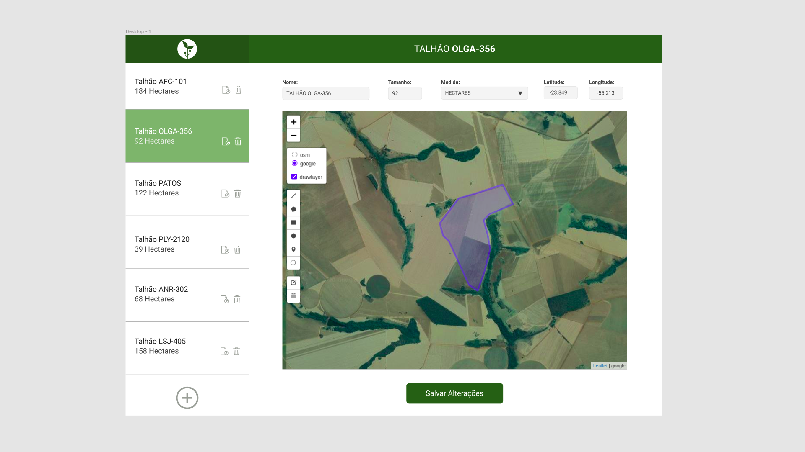

**OLÁ!**

Seja muito bem vindo ao processo de entrada para o time de desenvolvedores da Agrointeli!

É um prazer recebê-lo e, se você está aqui, é porque algo em nossa startup te atrai. E queremos corresponder à altura suas expectativas, para que esse possa ser um baita relacionamento. Vamos lá?

**PROPÓSITO:**

>Lembre-se: habilidades e competências precisam ser técnicas e comportamentais. Nem só uma e nem só outra pois, o dia a dia revelará uma árdua e penosa convivência. E seja honesto, você não quer isso, certo? Nem a gente! 

>O teste que virá a seguir vai te desafiar tecnicamente, e nos mostrará como você enxerga o mundo pela ótica de software. Adicionalmente, haverá o contato direto (via videochamada e/ou ligação) para entender de você como 
você enxerga sua existência e como esta pode fazer alguma diferença na vida de outas pessoas. 

**TESTE:**

Sua tarefa é implementar a seguinte tela

**Estórias:**

[1 - Como um usuário, quero listar os meus talhões.](../../issues/1)

[2 - Como um usuário, quero exibir um talhão.](../../issues/2)

[3 - Como um usuário, quero alterar a característica(polígonos) de um talhão.](../../issues/3)

[4 - Como um usuário, quero editar os campo de um talhão.](../../issues/4)

[5 - Como um usuário, quero excluir um polígono de um talhão.](../../issues/5)

[6 - Como um usuário, quero excluir um talhão.](../../issues/6)

[7 - Como um usuário, quero inserir um novo polígono em um talhão.](../../issues/7)

### *Orientações*

Stack à ser utilizada: 
- VueJS
- NodeJS (preferencialmente utilize Express)
- MongoDB

_Faça um fork desse repositório para resolver o desafio e, ao final, envie o link do seu repositório para o e-mail dev@agrointeli.com.br._

